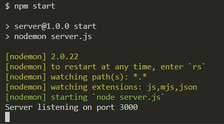
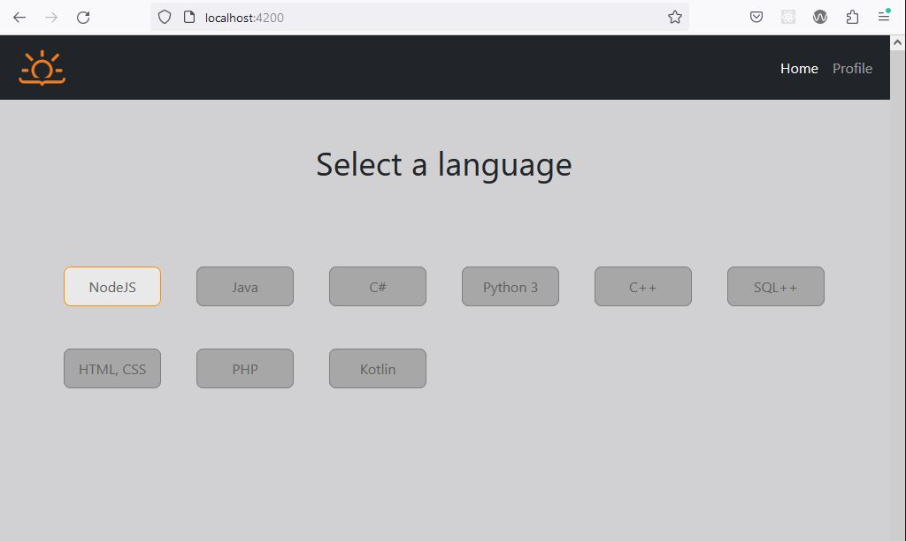
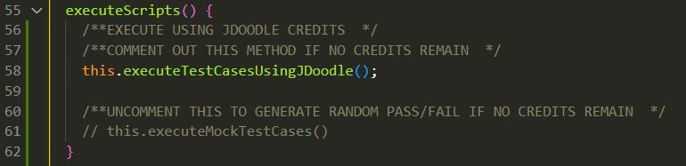

# ProgrammingTestApp

This project includes a ClientApp `/programming-test-app` and Server `/server`

To run the applicaiton, you must run these two programs on **Separate Terminals** at the same time.

## 1. Start Server

1. Navigate to directory `/server`
2. Run `npm install` to install all dependencies
3. Run `npm start` will start the server.
4. You should see the message *'Server listening on port 3000'*

## 2. Start Angular Client App

1. Start a new terminal
2. Navigate to directory `/programming-test-app`
3. Run `npm install` to install all dependencies
4. Run `ng serve` to start the application in dev mode
5. Navigate to `http://localhost:4200/`. The application will automatically reload if you change any of the source files.

## NOTE: Maximum JDoodle Credits
When the server is running, credits used can be checked using URL `http://localhost:3000/credits`. Each day, 200 credits can be used.

**Executing all test cases requires 25 credits**
When credits are expired, test cases can no longer be executed

1. Using VSCode, navigate to the file `/programming-test-app/src/app/modules/test-app/result-page/result-page.component.ts`
2. Comment out the method call `executeTestCasesUsingJDoodle()` on line 58
3. Uncomment the method call `executeMockTestCases()` on line 61
4. Save and re-run the application. The Results page should now generate static pass/fail results.

